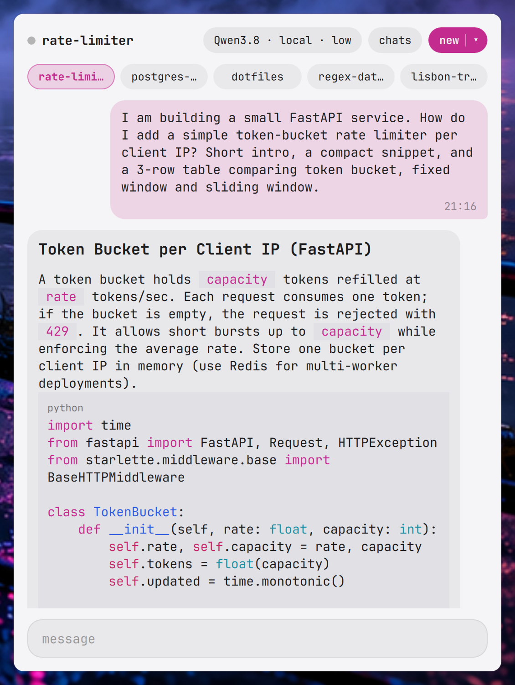
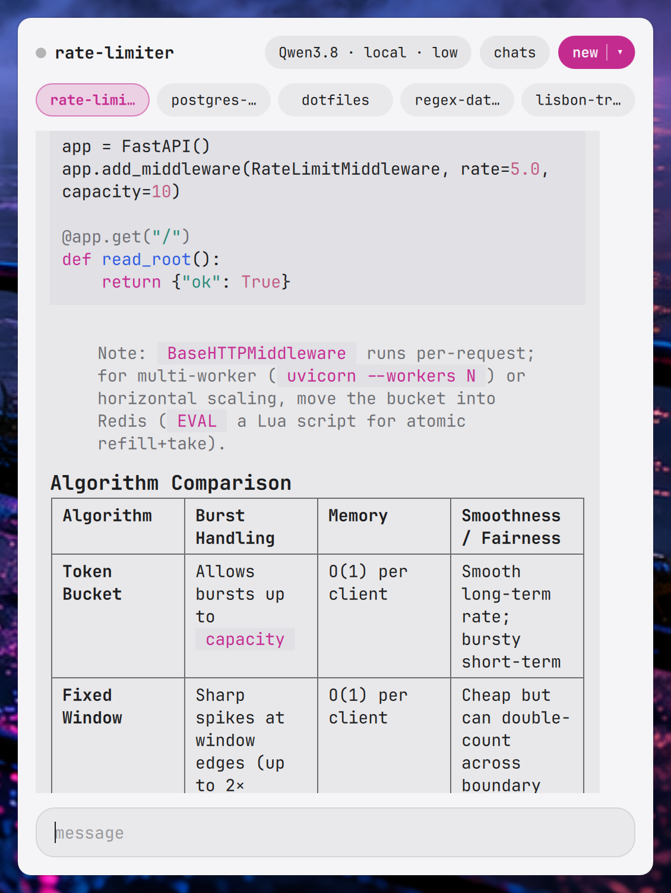
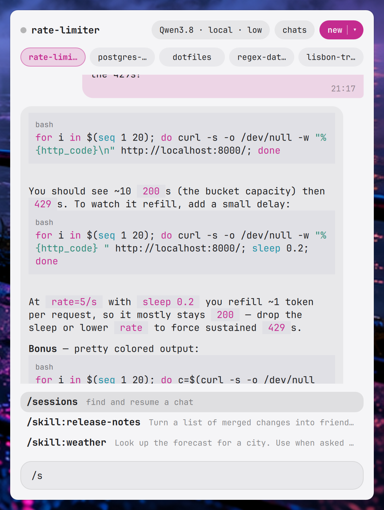
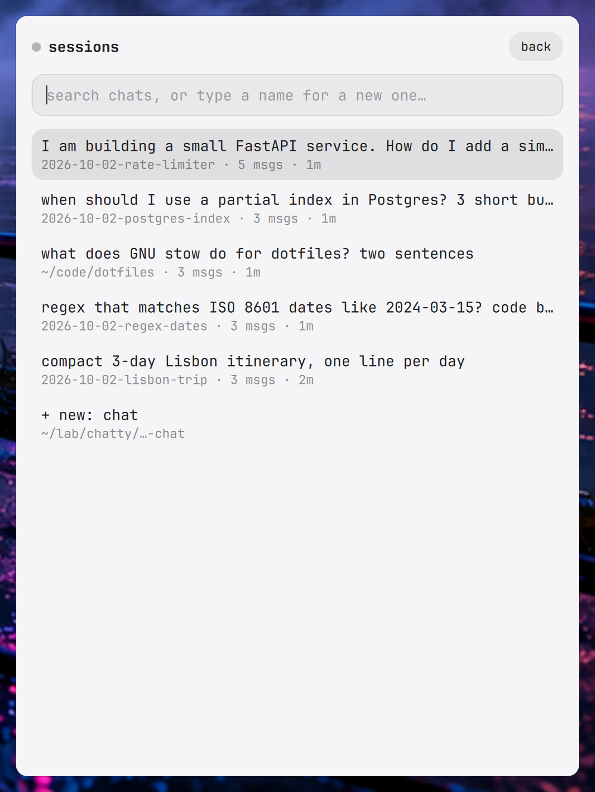
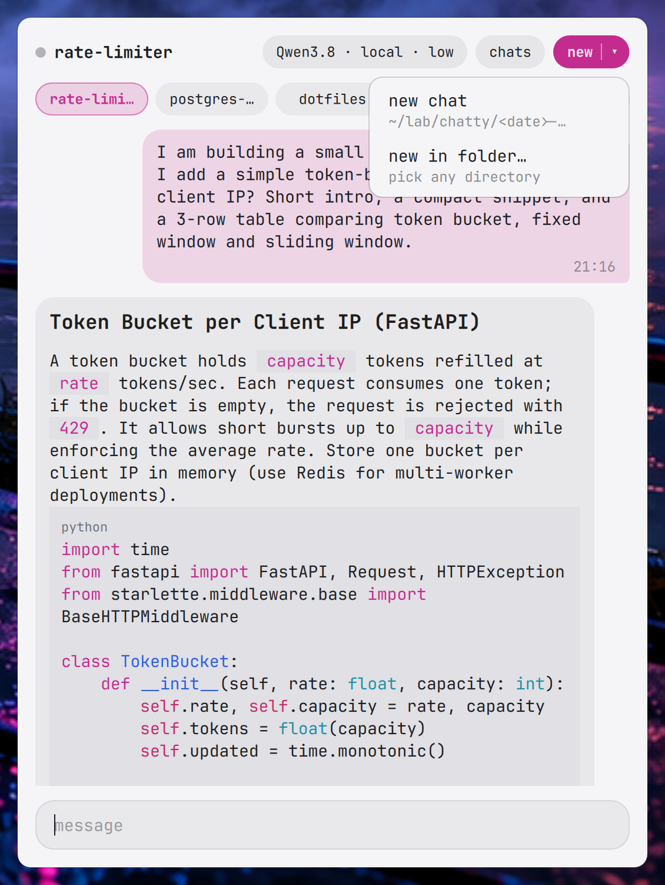
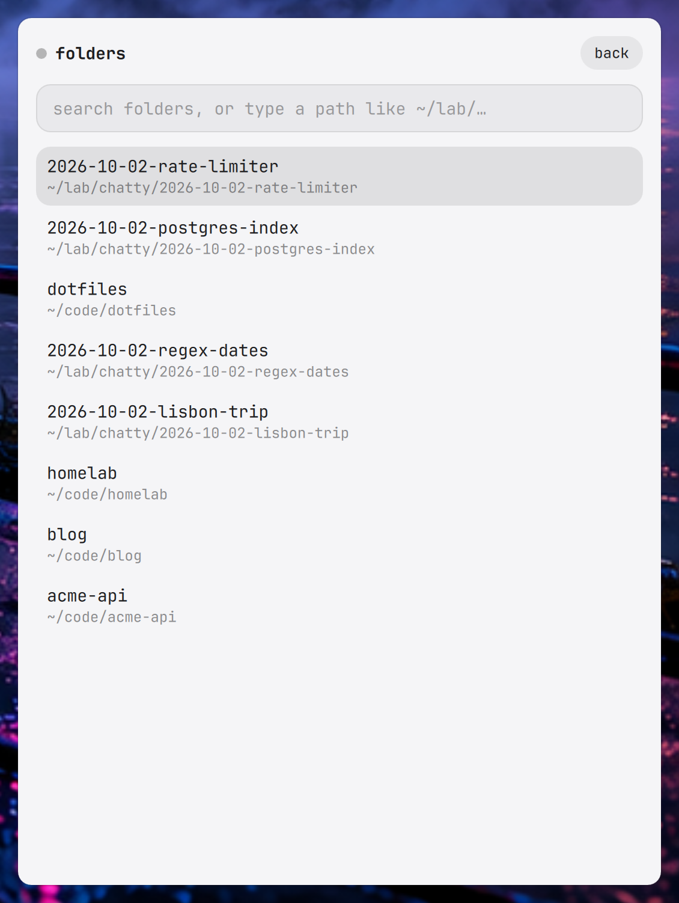

# omarchy-pi

A small floating chat for [Omarchy](https://omarchy.org), backed by a
persistent [pi](https://pi.dev) agent. Summon it with a key, ask, hide it: the
agent keeps working and the thread is there when you come back.

<p align="center">
  
</p>

```
Super+Shift+Space -> Chat.qml --socat--> $XDG_RUNTIME_DIR/omarchy-pi.sock -> daemon/server.mjs (pi SDK)
```

- **Your pi, not a copy.** The daemon uses the pi SDK with default services, so
  it loads your `~/.pi/agent` settings, auth, models, skills, extensions,
  prompt templates, and `AGENTS.md`, plus the CLI's built-in codemode,
  tool-search, and MCP extensions.
- **Survives the panel.** The agent runs in a systemd user service; closing
  the panel never stops a run, and reopening shows a reply mid-stream.
- **Chat app feel.** Bubbles with timestamps, markdown rendered with syntax
  highlighting in your Omarchy theme colors, copy button, typing indicator.
- **Slash commands.** `/` autocompletes your extension commands, `/skill:*`,
  prompt templates, and the built-ins below.
- **try-style workspaces.** Each chat gets a dated directory (inspired by
  [tobi/try](https://github.com/tobi/try)), e.g.
  `~/lab/chatty/2026-10-02-redis-pool`, which is the agent's working
  directory. Or start a chat in any folder.

## Screenshots

| Markdown & tables | Slash commands | Chats |
|---|---|---|
|  |  |  |

| New chat menu | New in folder | |
|---|---|---|
|  |  | |

Screenshots use a sandboxed `HOME` with mock chats and a local Qwen model.

## Requirements

- Omarchy with the Quickshell-based `omarchy-shell`
- [pi](https://pi.dev) set up and logged in (`~/.pi/agent`)
- Node.js >= 22.19
- `socat`
- optional: `zoxide` (better folder suggestions), `wl-copy` (copy button)

## Install

```bash
omarchy plugin add https://github.com/hjanuschka/omarchy-pi
~/.config/omarchy/plugins/hjanuschka.omarchy-pi/install.sh
```

or from a clone anywhere:

```bash
git clone https://github.com/hjanuschka/omarchy-pi && ./omarchy-pi/install.sh
```

`install.sh` installs the daemon's npm dependencies, creates and starts the
`omarchy-pi` systemd user service, enables the plugin, and binds
`Super+Shift+Space` in `~/.config/hypr/bindings.lua` (replacing Omarchy's
default "Toggle top bar" on that combo). Pick another key with
`OMARCHY_PI_KEY="SUPER + ALT + P" ./install.sh`, or skip it with
`OMARCHY_PI_KEY=none`.

Remove with `./uninstall.sh`; chats and sessions are kept.

## Use

| Key / control | Action |
|---|---|
| `Enter` | send (steers the agent while it is busy) |
| `Shift+Enter` | newline |
| `/` | command completion; `Tab`/`Enter` completes, `Up`/`Down` selects |
| `Esc` | close picker / completion, or hide the panel |
| model chip | fuzzy model picker |
| `chats` | fuzzy + recency + full-text search over every pi session, ending in `+ new: <query>` |
| `new` / `▾` | new try-style chat, or `new in folder…` (zoxide + past session dirs; type `~/…` to browse) |
| five chips | switch between your most recent chats |

Built-in commands: `/model [query]`, `/thinking [level]`, `/new [name]`,
`/sessions [query]`, `/compact [instructions]`, `/name <name>`. Everything
else goes through pi's own command handling.

## Configure

| Env (set in the service) | Default | |
|---|---|---|
| `OMARCHY_PI_ROOT` | `~/lab/chatty` | where new chat workspaces are created |

Scroll feel lives at the top of `Chat.qml` (`notchPixels`, `flingGain`).
Logs: `journalctl --user -u omarchy-pi -f`.

## Security

- The agent is your pi agent: it runs tools with your user's permissions,
  exactly like `pi` in a terminal. Extensions in `~/.pi` run unsandboxed.
- The control socket is created mode `0600` in `$XDG_RUNTIME_DIR`; anyone who
  can connect to it can drive the agent.
- Model output is never interpreted as HTML: raw HTML in replies is escaped
  before rendering.
- Extension dialogs (select/confirm/input) are answered as cancelled; the
  panel does not draw them.
- Nothing in this repo reads or stores credentials; pi handles auth from
  `~/.pi/agent/auth.json`. Chats are pi sessions under `~/.pi/agent/sessions`.

## License

MIT
